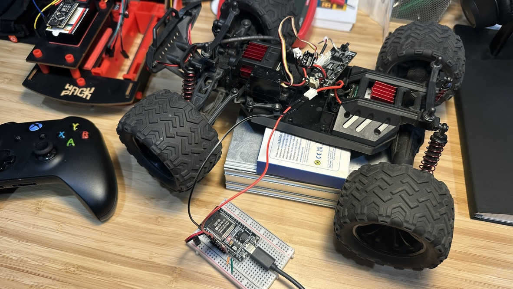
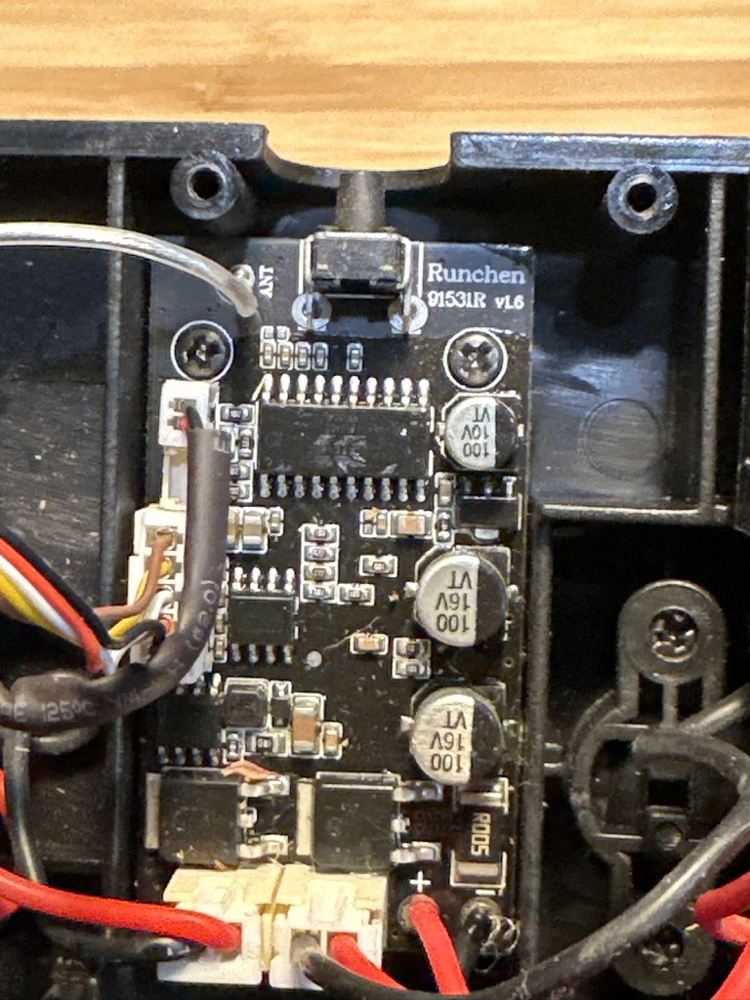
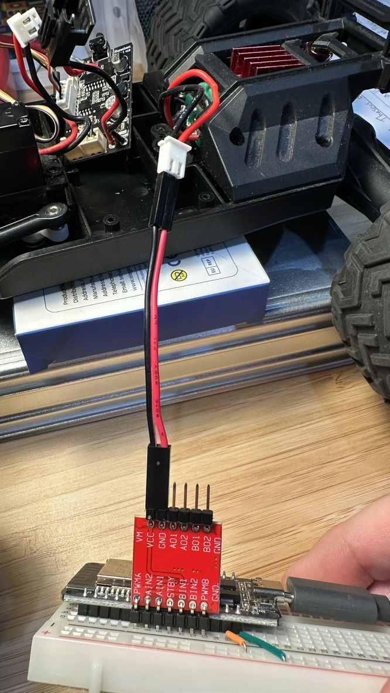
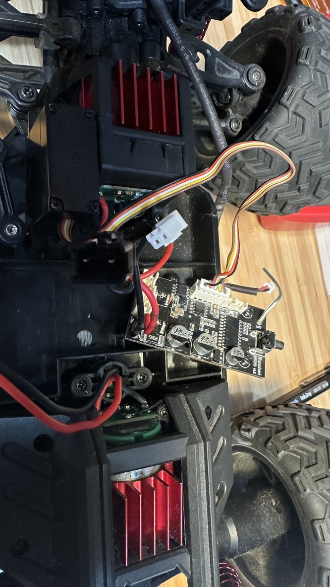

# RC Xbox Controller

Control your RC car using an Xbox Controller over Bluetooth Low Energy (BLE) with an ESP32-WROOM microcontroller.



## Overview

This project replaces the standard RC car controller with an ESP32-WROOM that receives input from an Xbox Controller via BLE using [Bluepad32](https://github.com/ricardoquesada/bluepad32). The system controls:

- **Drive Motor**: Forward/backward movement using Xbox triggers (LT/RT)
- **Steering**: Left/right direction using left thumbstick X-axis
- **Headlights**: LED control toggled with the Y button

## Hardware

### Components
- **ESP32-WROOM** (4MB flash)
- **TB6612FNG H-Bridge** motor driver
- **DC Drive Motor** (rear wheels)
- **Stepper Motor** (front wheel steering)
- **LED** (headlights)
- **Xbox Controller** (Bluetooth)

### Wiring

| Component | GPIO | Function |
|-----------|------|----------|
| Drive Motor PWM | 27 | PWMA |
| Drive Motor Direction | 25, 26 | AIN1, AIN2 |
| Steering PWM | 14 | PWMB |
| Steering Direction | 32, 33 | BIN1, BIN2 |
| Standby | 12 | STBY (HIGH) |
| Headlight LED | 4 | Output |



## Software Architecture

### Project Structure
```
rc-xbox-controller/
├── CMakeLists.txt          # ESP-IDF project config
├── sdkconfig.defaults      # Default build configuration
├── main/
│   ├── main.c              # Application entry point
│   ├── led.c/.h            # Headlight control
│   ├── motor_control.c/.h  # Drive motor (TB6612FNG Channel A)
│   ├── steering.c/.h       # Steering motor (TB6612FNG Channel B)
│   └── my_platform.c/.h    # Bluepad32 platform integration
├── hardware/               # KiCad PCB design files
├── Documents/              # Project documentation
└── assets/                 # Project images
```

### Control Mapping

| Xbox Input | Function | Range |
|------------|----------|-------|
| Left Trigger (LT) | Forward speed | 0-1023 → PWM |
| Right Trigger (RT) | Reverse speed | 0-1023 → PWM |
| Left Stick X-axis | Steering | -512 to +511 |
| Y Button | Toggle headlights | On/Off |

## Build & Flash

### Prerequisites

1. **ESP-IDF v5.4.1** or later
   ```bash
   # Follow ESP-IDF installation guide
   # https://docs.espressif.com/projects/esp-idf/en/latest/esp32/get-started/
   ```

2. **Bluepad32** component
   ```bash
   # Clone Bluepad32 to your ESP components directory
   cd ~/esp
   git clone --recursive https://github.com/ricardoquesada/bluepad32.git
   ```

3. **BTstack** integration
   ```bash
   cd ~/esp/bluepad32/external/btstack
   python integrate_btstack.py
   ```

### Build

```bash
# Set up ESP-IDF environment
get_idf

# Navigate to project directory
cd /path/to/rc-xbox-controller

# Set target (first time only)
idf.py set-target esp32

# Build project
idf.py build

# Flash to ESP32
idf.py -p /dev/ttyUSB0 flash monitor
```

## Usage

1. **Power on** the ESP32 and the RC car
2. **Pair** your Xbox Controller with the ESP32 (automatic BLE discovery)
3. **Drive**:
   - Press **LT** to move forward
   - Press **RT** to move backward
   - Move **left stick** left/right to steer
   - Press **Y** to toggle headlights
4. **Safety**: Motors automatically stop when the controller disconnects



## Implementation Status

### ✅ Phase 1 — Complete
- [x] BLE Xbox Controller integration (Bluepad32)
- [x] Drive motor control (forward/backward via triggers)
- [x] Steering control (via thumbstick)
- [x] LED headlight toggle (Y button)
- [x] Disconnect safety (motors stop on BLE disconnect)

### 🚧 Phase 2 — Planned
- [ ] Wi-Fi connectivity
- [ ] OTA firmware updates via web interface
- [ ] Web-based parameter tuning
- [ ] Advanced logging and diagnostics

## Development Notes

- **Dead-zone threshold**: 5% trigger range prevents motor hum at rest
- **Stepper limits**: Max step count configured to prevent mechanical over-travel
- **PWM frequency**: Default LEDC configuration for smooth motor control
- **BLE callbacks**: High-priority FreeRTOS task processes Bluepad32 events

## References

- [ESP-IDF Documentation](https://docs.espressif.com/projects/esp-idf/en/latest/esp32/)
- [Bluepad32 GitHub](https://github.com/ricardoquesada/bluepad32)
- [TB6612FNG Datasheet](https://www.sparkfun.com/datasheets/Robotics/TB6612FNG.pdf)
- [Project Documentation](Documents/)

## Gallery



## License

MIT License - See LICENSE file for details

## Contributing

Pull requests welcome! Please follow ESP-IDF coding standards and test thoroughly before submitting.

## Author

Built with ESP-IDF, Bluepad32, and ❤️ for RC cars

---

**Repository**: https://github.com/dcasati/rc-xbox-controller
